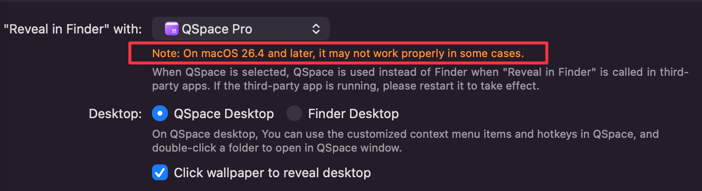

# QSpace Finder Redirector

[](https://github.com/Unintendedz/qspace-finder-redirector/actions/workflows/ci.yml)
[](https://github.com/Unintendedz/qspace-finder-redirector/releases/latest)

Open Finder-backed folders in QSpace Pro.

## Why

Have you set QSpace Pro as your Finder replacement, then noticed that opening `Downloads`, `Desktop`, Dock folders, Spotlight results, browser downloads, or "Reveal in Finder" still brings up Finder?

QSpace's official FAQ explains the normal setup here: [How to replace Finder?](https://qspace.awehunt.com/en-us/faq/howto-replace-finder.html)

That setup covers many cases. macOS can still route some folder opens through Finder. The QSpace Pro Open Mode screen also calls this out for newer macOS versions:



This project is for that gap. It runs a small LaunchAgent in your user session. When Finder opens a folder, the redirector reads that folder path, opens the same location in QSpace Pro, activates QSpace Pro, and closes the Finder window.

## What It Does

- Watches Finder windows in the current user session.
- Opens the same folder in QSpace Pro.
- Closes the Finder window.
- Adds a helper command: `qspace-open ~/Downloads`.
- Enables the QSpace Pro Finder extension when macOS allows it.
- Runs at login through a per-user LaunchAgent.

## Install

```bash
/bin/bash -c "$(curl -fsSL https://raw.githubusercontent.com/Unintendedz/qspace-finder-redirector/main/install.sh)"
```

Then approve any macOS Automation permission prompt for `osascript` controlling Finder and QSpace Pro.

## Uninstall

```bash
/bin/bash -c "$(curl -fsSL https://raw.githubusercontent.com/Unintendedz/qspace-finder-redirector/main/uninstall.sh)"
```

## Requirements

- macOS
- QSpace Pro installed as `QSpace Pro`
- User approval for macOS Automation prompts when requested

## Files Installed

```text
~/.local/bin/qspace-open
~/Library/Application Support/QSpaceFinderRedirector/redirector.applescript
~/Library/LaunchAgents/com.local.qspace-finder-redirector.plist
```

Logs go to:

```text
~/Library/Logs/qspace-finder-redirector.log
~/Library/Logs/qspace-finder-redirector.err
```

## Manual Commands

Reload the LaunchAgent:

```bash
launchctl bootout "gui/$(id -u)" ~/Library/LaunchAgents/com.local.qspace-finder-redirector.plist 2>/dev/null || true
launchctl bootstrap "gui/$(id -u)" ~/Library/LaunchAgents/com.local.qspace-finder-redirector.plist
```

Stop it:

```bash
launchctl bootout "gui/$(id -u)" ~/Library/LaunchAgents/com.local.qspace-finder-redirector.plist
```

Open a path directly in QSpace:

```bash
qspace-open ~/Downloads
```

## Privacy

The script runs locally. It does not send telemetry, collect file names, or contact any server. It only reads Finder window targets so it can open the same folder in QSpace Pro.

## Keywords

QSpace Pro, QSpace Finder replacement, macOS Finder replacement, replace Finder with QSpace, open Downloads in QSpace, open Desktop in QSpace, Reveal in Finder QSpace, FinderSync workaround, macOS file manager, QSpace default file manager, Finder redirector, LaunchAgent, AppleScript automation.

## Disclaimer

This project is community-made and is not affiliated with QSpace Pro or Apple.
